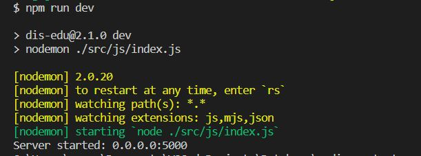
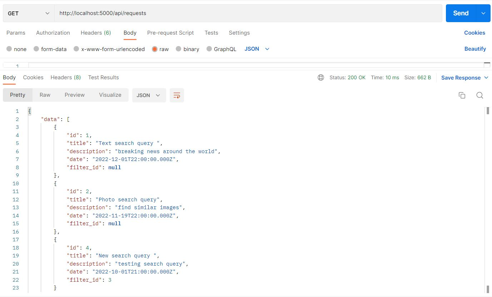
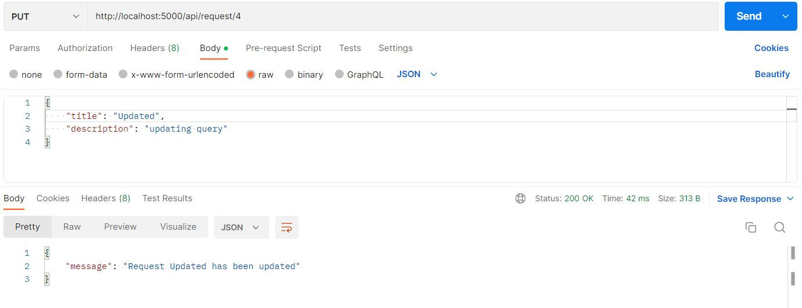

# Тестування працездатності системи

## Запуск сервера

## Додавання сутності (POST запит)

## Зчитування сутності (GET запит)

## Оновлення сутності (PUT запит)

### Результат

## Видалення сутності (DELETE запит)

### Результат

